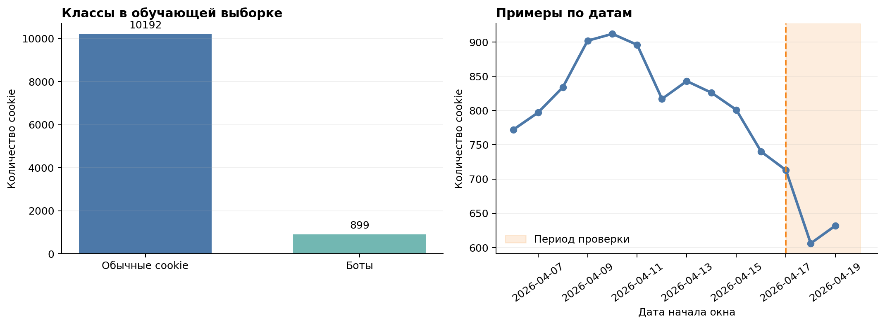
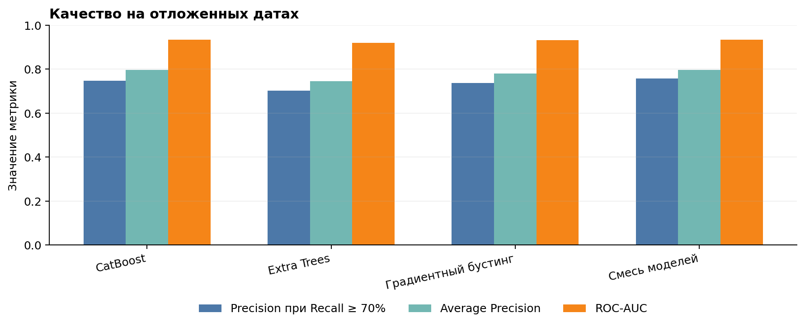
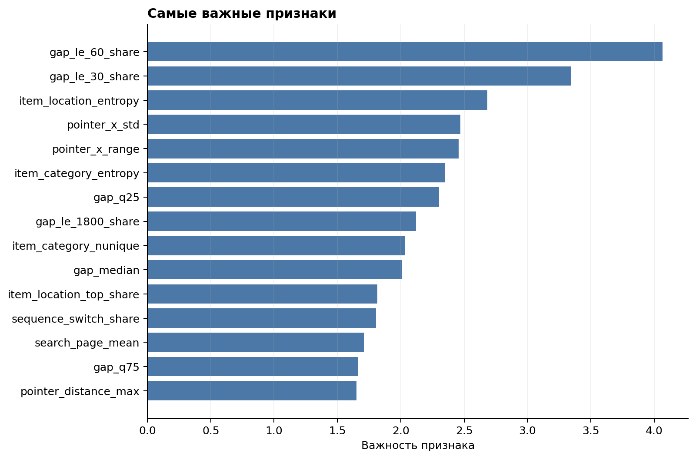
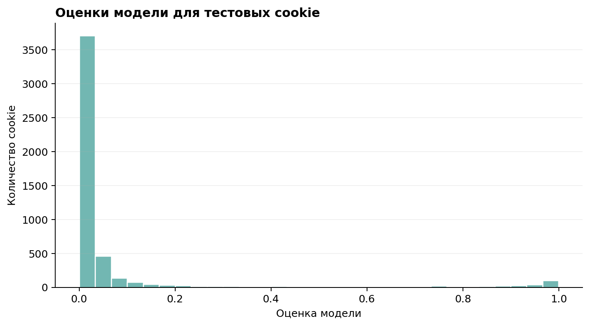

# Определение ботов по событиям Avito

Проект решает задачу классификации: по истории действий cookie нужно оценить,
похожа ли она на бота. Скрипт готовит признаки поведения и обучает CatBoost.

## Что делает модель

Сначала скрипт убирает полные дубли событий. Затем оставляет только события
внутри окна наблюдения каждой cookie (`window_start_ts <= event_ts < window_end_ts`)
и считает признаки: какие действия совершались, как часто, с какими паузами,
насколько разнообразны объявления и категории. Учитываются также сведения об
устройстве, User-Agent и движениях указателя.

Для проверки качества последние три дня обучающих данных отложены отдельно:
так проверка ближе к реальному сценарию, где модель оценивает более поздние
события. На этом временном разбиении удаление полных дублей повысило precision
при recall не ниже 70% с 0,7533 до 0,7619.

## Результаты

В обучающей выборке заметно больше обычных cookie, чем ботов. Последние три дня
отделены от обучения и используются для проверки модели.



На отложенных датах CatBoost сравнивается с двумя моделями и простой смесью
предсказаний. На графике показаны три метрики; отдельно измеренный эффект
удаления дублей указан выше.



Для CatBoost особенно полезны признаки, описывающие паузы между действиями,
разнообразие локаций и категорий, а также движения указателя.



Оценка модели — это не готовый ответ «бот или человек», а число от 0 до 1:
чем оно выше, тем сильнее cookie похожа на бота.



## Подготовка данных

Создайте папку `data/` и положите в неё:

- `train.csv` — обучающие примеры и целевой признак `target`;
- `test.csv` — примеры, для которых нужно получить оценки;
- `events.csv.gz` — историю действий cookie.

## Запуск

Установите зависимости:

```bash
python -m pip install -r requirements.txt
```

Проверить качество на отложенных датах:

```bash
python solution.py evaluate
```

Обучить модель и подготовить файл для отправки:

```bash
python solution.py train
```

Если запустить `python solution.py all` или просто `python solution.py`, сначала
выполнится проверка качества, затем обучение.

Чтобы пересобрать графики после обучения и проверки, выполните:

```bash
python make_report_figures.py
```

## Что появится после запуска

- `submission.csv` — оценки для отправки; в файле две колонки: `cookie_id` и `score`;
- `model.cbm` — обученная модель;
- `feature_importance.csv` — список самых важных признаков;
- `validation_results.json` — результаты проверки (после команд `evaluate` или `all`).

В ноутбуке есть графики распределения классов и дат, сравнение метрик моделей,
важность признаков и распределение итоговых оценок.

Если удобнее разбираться по шагам, откройте
[ноутбук с объяснением решения](./solution_walkthrough.ipynb).
